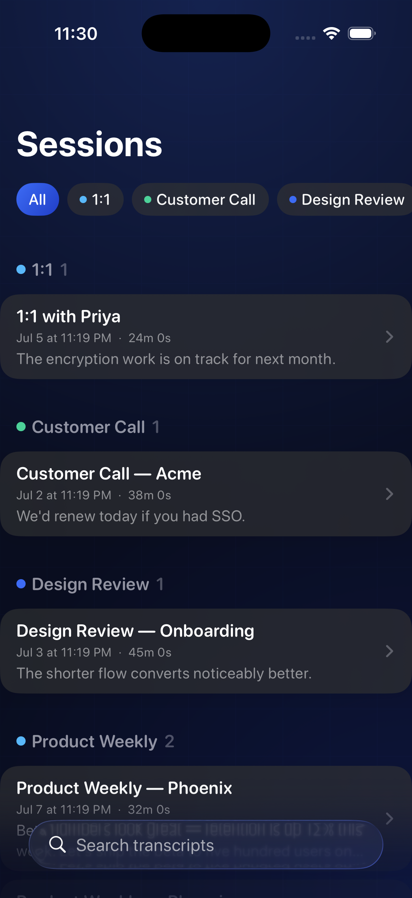
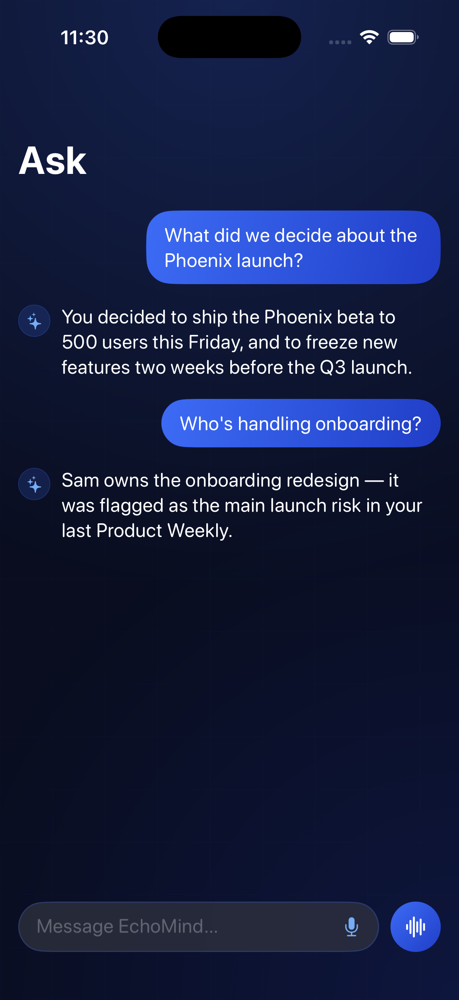
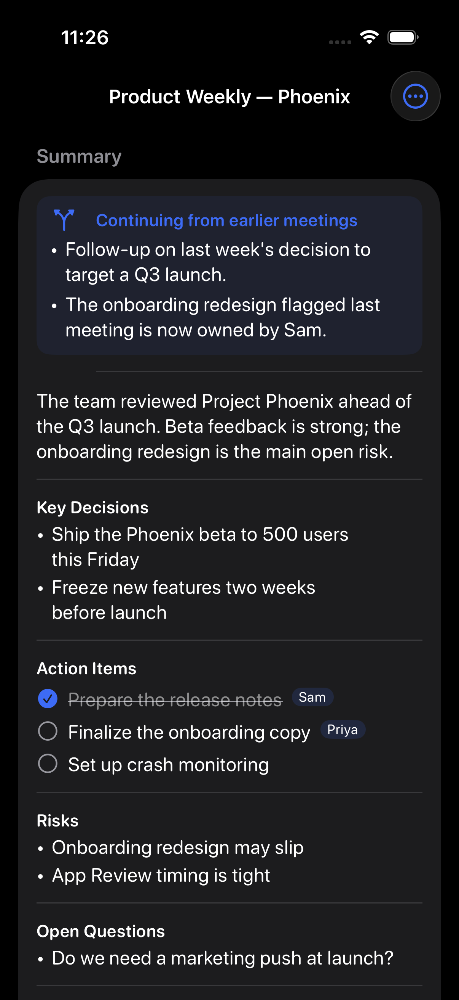
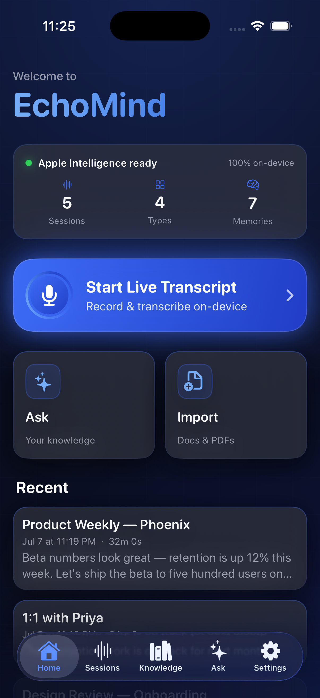

<div align="center">

# EchoMind

### Private meeting memory for your iPhone

**Record → transcribe → auto-report → ask.** All on-device. Nothing ever leaves your iPhone.

[](https://github.com/RW2523/EchoMind/actions/workflows/ci.yml)


</div>

---

EchoMind turns every meeting into searchable memory — without sending a single word to
the cloud. Record on your iPhone and it transcribes live; the moment you stop, Apple
Intelligence writes a clean report (summary, decisions, action items). Meetings are
grouped by topic automatically, a long-term memory builds across every meeting, and you
can ask questions by text or voice.

## Screenshots

| Home | Sessions (grouped) | Ask | Report | Memory |
|---|---|---|---|---|
|  |  |  |  |  |

## Features

- 🎙️ **Live transcription** — on-device speech-to-text (SpeechAnalyzer), keeps recording while the screen is locked.
- 📝 **Auto reports** — summary, key decisions, and check-off action items generated automatically when you stop — and the session **names itself** from what was discussed.
- ✅ **Reminders export** — send a report's action items to Apple Reminders with one tap.
- 🔐 **App lock** — optional Face ID / Touch ID gate on opening the app.
- 🗂️ **Smart grouping** — meetings are clustered by concept and AI-labeled, so similar meetings organize themselves.
- 🧠 **Total recall** — a durable cross-session memory of people, projects, and decisions, used to answer with context from *every* past meeting.
- 🔗 **Report continuity** — new reports reference prior related meetings ("follow-up on last week's decision…").
- 💬 **Ask anything** — chat with your meetings and documents (hybrid RAG), grounded with sources — by text **or voice** (push-to-talk, streaming, hands-free with barge-in).
- ▶️ **Tap-to-play** — retained audio with a scrubber; tap any transcript line to jump there.
- 📄 **Import** — PDFs and notes searchable alongside your meetings.
- 🔒 **Private by design** — 100% on-device, no account, no tracking, **zero network calls** (enforced by a test). Export or delete everything anytime.

## Privacy

EchoMind collects **no data** and makes **no network requests** in normal use. Transcription
and all AI (summaries, grouping, memory, answers) run on the device via Apple's
SpeechAnalyzer and Apple Intelligence. Recordings, transcripts, and notes live only in the
app's protected, sandboxed storage. This is verified by `NetworkAuditTests` in CI.
See [AppStore/PRIVACY_POLICY.md](AppStore/PRIVACY_POLICY.md).

## Architecture

MVVM + protocol-based services, composed once in `AppDependencies`.

```
Features/<Feature>/{View, ViewModel}          SwiftUI + @Observable view models
Core/Audio        AVAudioEngine capture, interruptions, retained audio
Core/Transcription SpeechAnalyzer behind TranscriptionService
Core/AI           RoutingModelGateway (Apple FM ▸ local LLM ▸ retrieval-only),
                  TokenBudgeter, Summarizer, ReportPipeline, MeetingClassifier,
                  MemoryDistiller, MeetingContinuityService
Core/RAG          TextChunker, embeddings, VectorSearch, BM25, RRF, MMR,
                  RAGPipeline, SessionClusterer, VectorStore
Core/Voice        VoiceSessionController, SpeechSynthesizing, SentenceChunker, TurnEndpointer
Core/Storage      SwiftData @Model + @ModelActor repositories (Sendable snapshots)
Models/           pure value types
```

Design principles: **every service is a protocol with one implementation**; all AI goes
through a single routed gateway; **every optional third-party engine sits behind exactly one
`#if canImport` file** with a first-party floor, so the app builds and ships with zero
packages. Details in [docs/ARCHITECTURE.md](docs/ARCHITECTURE.md).

## Requirements

- Xcode 26+, iOS 26 SDK
- An **Apple-Intelligence-capable iPhone** for on-device AI summaries/answers (transcription works more broadly)
- Swift 6, strict concurrency

## Build & run

```bash
git clone https://github.com/RW2523/EchoMind.git
open EchoMind/EchoMind.xcodeproj    # then ⌘R on a simulator or device
```

Command line:

```bash
# Build
xcodebuild -scheme EchoMind -destination 'platform=iOS Simulator,name=iPhone 17 Pro' build
# Test (run serially — CoreSimulator dislikes parallel here)
xcodebuild -scheme EchoMind -destination 'platform=iOS Simulator,name=iPhone 17 Pro' \
  -only-testing:EchoMindTests -parallel-testing-enabled NO test
```

**299 tests** cover the pure logic exhaustively — clustering (order-invariant), chunking,
token budgeting, memory distillation, RAG fusion, the voice state machine, and the
zero-network audit. Anything touching mic/speech/on-device models is device-only.

## Status

| Area | Status |
|---|---|
| Live transcription, sessions, import, RAG chat/voice, reports, grouping, memory | ✅ Shipped |
| Verified live (grounded RAG with real generation, in-simulator) | ✅ |
| Local LLM (Qwen/MLX), EmbeddingGemma, sqlite-vec, Kokoro TTS, diarization (FluidAudio) | 🔌 Code-complete behind `#if canImport` — add packages to enable |
| Device validation of the record/voice loop | ⏳ [Checklist](AppStore/DEVICE_TEST_CHECKLIST.md) — needs a physical iPhone |
| App Store submission | ⏳ Build-ready; needs paid Developer Program — see [AppStore/TESTFLIGHT.md](AppStore/TESTFLIGHT.md) |

## Optional on-device model packs (1.1)

Adding a Swift package lights up a downloadable model, each isolated behind one file:

| Pack | Package | Enables |
|---|---|---|
| Local LLM | `ml-explore/mlx-swift-examples` (MLXLLM) | Full AI with Apple Intelligence off |
| Embeddings | MLXEmbedders | EmbeddingGemma retrieval |
| Diarization | `FluidInference/FluidAudio` | Speaker labels |
| Voice | FluidAudio TTS / Kokoro | Warm "af_heart" voice |

Steps in [PACKAGES.md](PACKAGES.md).

## Documentation

- **[User Manual](docs/USER_MANUAL.md)** — how to use every feature
- **[Architecture](docs/ARCHITECTURE.md)** — how the app is built
- **[FAQ](docs/FAQ.md)** — common questions
- **[Wiki](https://github.com/RW2523/EchoMind/wiki)** — same content, browsable
- Design docs: [PLAN.md](PLAN.md), [SMART_MEETINGS_PLAN.md](SMART_MEETINGS_PLAN.md), [VOICE_AGENT_PLAN.md](VOICE_AGENT_PLAN.md), [MODEL_STACK_PLAN.md](MODEL_STACK_PLAN.md)
- Shipping: [PRODUCTION_PLAN.md](PRODUCTION_PLAN.md), [AppStore/](AppStore/)

## License

© 2026 AJACE. Source-available for personal evaluation and learning — no
redistribution or commercial use without permission. See [LICENSE](LICENSE).
